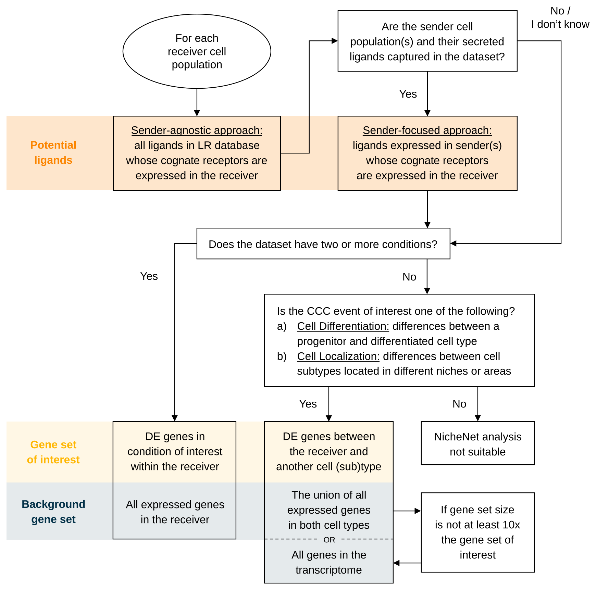

```{r setup, include=FALSE}
knitr::opts_chunk$set(echo = TRUE)
```

# Materials
## Equipment setup

### Input data

To follow the procedure below, users must provide a Seurat object (version ≥3) containing the gene expression matrix and cell type annotations. Nevertheless, this pipeline can be easily adapted to work with expression data stored in other formats (see Troubleshooting). The data should be preprocessed appropriately for differential expression analysis, such as through quality control, normalization and batch correction.

### Hardware

Windows, Linux or macOS

### Software

R (RStudio is recommended)

NicheNet can be installed by running the following command in R:

```{r software installation, eval=FALSE}
if (!requireNamespace("devtools", quietly=TRUE))
  install.packages("devtools") 

devtools::install_github("saeyslab/nichenetr")

```

### Example data

As example expression data of interacting cells, we will use mouse NICHE-seq data from Medaglia et al. (2017) to explore intercellular communication in the T cell area in the inguinal lymph node before and 72 hours after lymphocytic choriomeningitis virus (LCMV) infection. Specifically, we will prioritize which ligands can best explain the downstream changes after LCMV infection in CD8 T cells as the receiver population. This dataset contains 13,541 genes and 5,027 cells from 6 cell populations: CD4 T cells (including regulatory T cells), CD8 T cells, B cells, natural killer (NK) cells, dendritic cells (DCs) and inflammatory monocytes.

Download the data by clicking ‘seuratObj.rds’ at https://zenodo.org/record/353188941. To download the file with the command line, use commands such as wget or curl (Linux/macOS):

`wget https://zenodo.org/record/3531889/files/seuratObj.rds`

To download the file within the R session, entering the following commands:

```{r download data within the R session}

options(timeout = 3600) # increase time limit for downloading the data 
seuratObj <- readRDS(url("https://zenodo.org/record/3531889/files/seuratObj.rds")) 

```

If the file is downloaded within the R session, it will have to be downloaded again once the session is restarted.

### Human/Mouse networks

Three networks are required to run the NicheNet analysis: the ligand-target prior model, the ligand-receptor network, and the weighted ligand-receptor network. We provide these networks with either human or mouse gene symbols and they can be downloaded at https://zenodo.org/record/7074291/. This repository also contains other networks not used in the main analysis but in an additional visualization step (Step 31) and during model construction (Box 3). As with the example data, they can be downloaded locally through the website or command line, or in the R session. We recommend users to download them locally for convenience. 

#### Downloading data locally

```{r download NicheNet networks CLI, eval=FALSE}

ZENODO_PATH=https://zenodo.org/record/7074291/files

# Human ligand-target, ligand-receptor, and weighted networks
wget $ZENODO_PATH/ligand_target_matrix_nsga2r_final.rds
wget $ZENODO_PATH/lr_network_human_21122021.rds
wget $ZENODO_PATH/weighted_networks_nsga2r_final.rds

# Mouse ligand-target, ligand-receptor, and weighted networks
wget $ZENODO_PATH/ligand_target_matrix_nsga2r_final_mouse.rds
wget $ZENODO_PATH/lr_network_mouse_21122021.rds
wget $ZENODO_PATH/weighted_networks_nsga2r_final_mouse.rds

```

#### Download the file in the R session, mouse example

```{r download NicheNet networks}

zenodo_path <- "https://zenodo.org/record/7074291/files/" 

ligand_target_matrix <- readRDS(url(paste0(zenodo_path, "ligand_target_matrix_nsga2r_final_mouse.rds"))) 
lr_network <- readRDS(url(paste0(zenodo_path, "lr_network_mouse_21122021.rds"))) 
weighted_networks <- readRDS(url(paste0(zenodo_path, "weighted_networks_nsga2r_final_mouse.rds"))) 


ligand_target_matrix[1:5, 1:5] # target genes in rows, ligands in columns
head(lr_network)
head(weighted_networks$lr_sig) # interactions and their weights in the ligand-receptor + signaling network
```

# Procedure

Here, we describe the procedure for both the sender-focused and sender-agnostic approach, as shown here:


{width=75%}

As two conditions are present in this example dataset (steady state and 3 days after LCMV infection), the gene set of interest is chosen as the DE genes between these conditions in the receiver cell type. Box 4 details the use of wrapper functions that can automatically run Steps 5-24 (without Step 15).

## Feature extraction

1. Load required libraries.

```{r feature extraction - I, warning=FALSE, message=FALSE}

library(nichenetr)
library(Seurat) 
library(tidyverse) 

```

2. *(Optional)* For older Seurat objects, update it to be compatible with the currently installed Seurat version. For expression data with older gene symbols, convert them to more recent gene symbols. When analyzing a human dataset, change the second argument to "human". Aside from downloading the correct networks, this is the only point in the analysis where the code differs between human and mouse datasets.

```{r feature extraction - II, message=FALSE, warning=FALSE}
seuratObj <- UpdateSeuratObject(seuratObj)
seuratObj <- alias_to_symbol_seurat(seuratObj, "mouse")

seuratObj
```

3. Set the cell type annotation column as the identity of the Seurat object.

```{r feature extraction - III}

Idents(seuratObj) <- seuratObj$celltype 

```

4. Define a "receiver" cell population. The receiver cell population can only consist of one cell type.

```{r feature extraction - IV}

receiver <- "CD8 T" 

```

5. Determine which genes are expressed in the receiver cell population. The function `get_expressed_genes` considers genes to be expressed if they have non-zero counts in a certain percentage of the cell population (by default set at 10%). Here, we have lowered the threshold to 5% (`pct`) as some of the ligands and receptors are very lowly expressed. Users are also free to define expressed genes differently in a way that fits their data.  

```{r feature extraction - V}

expressed_genes_receiver <- get_expressed_genes(receiver, seuratObj,  pct = 0.05)

# Preview
length(expressed_genes_receiver)
head(expressed_genes_receiver)
```


6. Get a list of all receptors available in the ligand-receptor network, and define expressed receptors as genes that are in the ligand-receptor network and expressed in the receiver.

```{r feature extraction - VI}

all_receptors <- unique(lr_network$to)  
expressed_receptors <- intersect(all_receptors, expressed_genes_receiver) 

# Preview
length(expressed_receptors)
head(expressed_receptors)

```

7. Define the potential ligands as all ligands whose cognate receptors are expressed.

```{r feature extraction - VII}

potential_ligands <- lr_network[lr_network$to %in% expressed_receptors, ] 
potential_ligands <- unique(potential_ligands$from) 

# Preview
length(potential_ligands)
head(potential_ligands)

```

8. *(Optional)* For the sender-focused approach, define sender cell types and expressed genes in all populations combined. Then, filter potential ligands to those that are expressed in sender cells.

```{r feature extraction - VIII}

sender_celltypes <- c("CD4 T", "Treg", "Mono", "NK", "B", "DC") 
list_expressed_genes_sender <- lapply(sender_celltypes, function(celltype) {
    get_expressed_genes(celltype, seuratObj, pct = 0.05)
  }) 
expressed_genes_sender <- unique(unlist(list_expressed_genes_sender)) 
potential_ligands_focused <- intersect(potential_ligands, expressed_genes_sender) 

# Preview
length(expressed_genes_sender)
head(expressed_genes_sender)
length(potential_ligands_focused)
head(potential_ligands_focused)
```

9. Define the reference condition and condition of interest. The condition of interest is the condition after the CCC event has taken place, or the 'case' group in case-control studies. Here, it represents the condition after LCMV infection. Similarly, the reference condition is the state before the CCC event, often referred to as the control or steady-state condition.

```{r feature extraction - IX}

condition_oi <- "LCMV" 
condition_reference <- "SS" 

```

10. Define the gene set of interest that represents the cell-cell communication event to be studied. First, create a new Seurat object that only contains the receiver cell type. Then, perform DE analysis between the treatment conditions within the receiver cell type. Finally, define the gene set of interest as significantly DE genes (i.e., genes with adjusted p-value lower than or equal to 0.05 and absolute log-fold change greater than 0.25).

By default, both genes that are up and downregulated are considered. Users can choose to focus on only one direction (typically upregulation) by removing the `abs()` function and adjusting the equality term to either \>= 0.25 or \<= -0.25 for up and downregulation, respectively. We recommend the gene set of interest to contain between 20 and 2000 genes for optimal ligand activity prediction. Moreover, the number of background genes should be sufficiently greater than those of the gene set of interest.

```{r feature extraction - X}

seurat_obj_receiver <- subset(seuratObj, idents = receiver)
DE_table_receiver <- FindMarkers(object = seurat_obj_receiver,  
                                 ident.1 = condition_oi,
                                 ident.2 = condition_reference,
                                 group.by = "aggregate",
                                 min.pct = 0.05) 

geneset_oi <- DE_table_receiver[DE_table_receiver$p_val_adj <= 0.05 &
                                  abs(DE_table_receiver$avg_log2FC) >= 0.25, ] 
geneset_oi <- rownames(geneset_oi)[rownames(geneset_oi) %in% rownames(ligand_target_matrix)] 

# Preview
length(geneset_oi)
head(geneset_oi)
```

11. Determine background genes as all the genes expressed in the receiver cell type that are also in the ligand-target matrix.

```{r feature extraction - XI}

background_expressed_genes <- expressed_genes_receiver[
  expressed_genes_receiver %in% rownames(ligand_target_matrix)] 

# Preview
length(background_expressed_genes)
head(background_expressed_genes)
```

## Ligand activity analysis and downstream prediction

12. Perform the ligand activity analysis, then sort the ligands based on the area under the precision-recall curve (AUPR).

```{r ligand activity - I}

ligand_activities <- predict_ligand_activities(
  geneset = geneset_oi,
  background_expressed_genes = background_expressed_genes,
  ligand_target_matrix = ligand_target_matrix,
  potential_ligands = potential_ligands) 

ligand_activities <- ligand_activities[order(ligand_activities$aupr_corrected,
                                             decreasing = TRUE), ] 

# Preview
dim(ligand_activities)
head(ligand_activities)
```

13. *(Optional)* If performing the sender-focused approach, subset the ligand activities to only contain expressed ligands.
**Note:** When using the sender-agnostic approach, simply replace `ligand_activities` with `ligand_activities_all` in Steps 14 and 18.

```{r ligand activity - II}

ligand_activities_all <- ligand_activities 
ligand_activities <- ligand_activities[ligand_activities$test_ligand %in%
                                         potential_ligands_focused, ] 

# Preview
dim(ligand_activities)
head(ligand_activities)
```

14. Obtain the names of the top 30 ligands.

```{r ligand activity - III}

best_upstream_ligands <- top_n(ligand_activities, 30, aupr_corrected)$test_ligand 
 
# Preview
length(best_upstream_ligands)
head(best_upstream_ligands)
```

15. *(Optional)* Assess the quality of predicted ligands according to Box 5. 

16. Infer which genes in the gene set of interest have the highest regulatory potential for each top-ranked ligand. The function `get_weighted_ligand_target_links` will return genes that are in the gene set of interest and are the top `n` targets of a ligand (default: `n = 250`).

```{r ligand activity - IV}

active_ligand_target_links_df <- lapply(best_upstream_ligands,
                                        get_weighted_ligand_target_links, 
                                        geneset = geneset_oi, 
                                        ligand_target_matrix = ligand_target_matrix, 
                                        n = 200) 

active_ligand_target_links_df <- drop_na(bind_rows(active_ligand_target_links_df)) 

# Preview
dim(active_ligand_target_links_df)
head(active_ligand_target_links_df)
```

17. Similarly, identify which receptors have the highest interaction potential with the top-ranked ligands.

```{r ligand activity - V}

ligand_receptor_links_df <- get_weighted_ligand_receptor_links(
  best_upstream_ligands = best_upstream_ligands,
  expressed_receptors = expressed_receptors,
  lr_network = lr_network,
  weighted_networks_lr_sig = weighted_networks$lr_sig
)

# Preview
dim(ligand_receptor_links_df)
head(ligand_receptor_links_df)

```

## Visualizations
This section can be followed in its entirety only for the sender-focused approach
(i.e., if all optional code in the previous sections have been executed); for the sender-agnostic approach, only Steps 19-21 and Steps 31 and 32 are relevant. The code from this section will produce slightly different visualizations from Fig. 3
because of adjustments in `theme` and cutoff values; the exact code for reproducing the figure is available in our [GitHub repository](https://github.com/saeyslab/nichenet_protocol).

18. Create a heatmap of the ligand activity measure (Figure 3a).

```{r visualizations-I, fig.width=3, fig.height=5}

ligand_aupr_matrix <- column_to_rownames(ligand_activities, "test_ligand") 
ligand_aupr_matrix <- ligand_aupr_matrix[rev(best_upstream_ligands), "aupr_corrected", drop=FALSE] 
vis_ligand_aupr <- as.matrix(ligand_aupr_matrix, ncol = 1) 

(make_heatmap_ggplot(vis_ligand_aupr,
                     y_name = "Prioritized ligands", x_name = "Ligand activity",
                     legend_title = "AUPR", color = "darkorange") + 
    theme(axis.text.x.top = element_blank()))  

```


19. Prepare the weighted ligand-target data frame for visualization by transforming it into matrix. By default, regulatory potentials lower than the 25th percentile are set to zero for visualization clarity. This cutoff parameter can freely be tuned by the user.

```{r visualizations-II}

active_ligand_target_links <- prepare_ligand_target_visualization(
  ligand_target_df = active_ligand_target_links_df,
  ligand_target_matrix = ligand_target_matrix,
  cutoff = 0.25) 

```

20. Order the rows to follow the rankings of the ligands, and the columns alphabetically (Figure 3b).

```{r visualizations-III, fig.width=10}

order_ligands <- rev(intersect(best_upstream_ligands, colnames(active_ligand_target_links))) 
order_targets <- intersect(unique(active_ligand_target_links_df$target), rownames(active_ligand_target_links)) 

vis_ligand_target <- t(active_ligand_target_links[order_targets,order_ligands])

(make_heatmap_ggplot(vis_ligand_target,
                     y_name = "Prioritized ligands", x_name = "Predicted target genes",
                     color = "purple", legend_title = "Regulatory potential") + 
    scale_fill_gradient2(low = "whitesmoke",  high = "purple")) 

```

21. Create a heatmap for ligand-receptor interactions (Figure 3c).

```{r visualizations-IV, fig.width=8}

vis_ligand_receptor_network <- prepare_ligand_receptor_visualization(
  ligand_receptor_links_df, best_upstream_ligands,
  order_hclust = "receptors") 

(make_heatmap_ggplot(t(vis_ligand_receptor_network), 
                     y_name = "Prioritized ligands", x_name = "Receptors",  
                     color = "mediumvioletred", legend_title = "Prior interaction potential")) 
 
```

22. For each cell type, compute the log-fold change of the top-ranked ligands between treatment conditions.

```{r visualizations-V}

celltype_order <- levels(Idents(seuratObj)) 

DE_table_top_ligands <- lapply(
  celltype_order[celltype_order %in% sender_celltypes],
  get_lfc_celltype, 
  seurat_obj = seuratObj,
  condition_colname = "aggregate",
  condition_oi = condition_oi,
  condition_reference = condition_reference,
  celltype_col = "celltype",
  min.pct = 0, logfc.threshold = 0,
  features = best_upstream_ligands 
) 

DE_table_top_ligands <- reduce(DE_table_top_ligands, full_join) 
DE_table_top_ligands <- column_to_rownames(DE_table_top_ligands, "gene") 
 
```

23. Create the heatmap (Figure 3d).

```{r visualizations-VI, fig.width=6, fig.height=6}

vis_ligand_lfc <- as.matrix(DE_table_top_ligands[rev(best_upstream_ligands), , drop=FALSE]) 

(make_threecolor_heatmap_ggplot(vis_ligand_lfc,
                                y_name = "Prioritized ligands", x_name = "LFC in Sender",
                                low_color = "midnightblue", mid_color = "white",
                                mid = median(vis_ligand_lfc), high_color = "red",
                                legend_title = "LFC")) 
 
```

24. Create a dot plot showing the average expression of ligands per cell type, as well as the percentage of cells from the cell type expressing the ligands (Figure 3e).

```{r visualizations-VII, fig.width=8, fig.height=6}

DotPlot(subset(seuratObj, celltype %in% sender_celltypes),
        features = rev(best_upstream_ligands), cols = "RdYlBu") + 
  coord_flip() +
  scale_y_discrete(position = "right") 

```

25. Create a line plot comparing the rankings between the sender-agnostic and sender-focused approach (Figure 3f).

```{r visualizations-VIII}

(make_line_plot(ligand_activities = ligand_activities_all,
                potential_ligands = potential_ligands_focused) +
   theme(plot.title = element_text(size=11, hjust=0.1, margin=margin(0, 0, -5, 0))))

```

26. To create a ligand-target chord diagram, assign each ligand to a specific cell type. The aggregation and assignment functions can be specified through the
`func.agg` and `func.assign` parameters. By default, these parameters are set to `mean` and `function(x) {mean(x)+sd(x)}`, respectively.

```{r visualizations-IX}

ligand_type_indication_df <- assign_ligands_to_celltype(seuratObj, best_upstream_ligands[1:20], celltype_col = "celltype") 

# Preview
dim(ligand_type_indication_df)
head(ligand_type_indication_df)

```


27. Using the weighted ligand-target data frame from Step 16, group target genes and filter out the lowest 40% of the regulatory potentials. In this case, there is only one grouping of target genes (DE genes after LCMV infection), but users can define multiple target gene groups if applicable. In case the resulting chord diagram is still overcrowded, users may adjust the `cutoff` parameter to filter out even more ligand-target links.

```{r visualizations-X}

active_ligand_target_links_df$target_type <- "LCMV-DE" 
circos_links <- get_ligand_target_links_oi(ligand_type_indication_df,
                                           active_ligand_target_links_df, cutoff = 0.75) 

# Preview
dim(circos_links)
head(circos_links)

```

28. Assign colors to cell types and target gene groups. Then, prepare the data frame for visualization: the function assigns colors to ligands and targets and calculates gaps between sectors of the chord diagram.

```{r visualizations-XI}

ligand_colors <- c("General" = "#377EB8", "NK" = "#4DAF4A", "B" = "#984EA3",
                   "Mono" = "#FF7F00", "DC" = "#FFFF33", "Treg" = "#F781BF",
                   "CD8 T"= "#E41A1C") 
target_colors <- c("LCMV-DE" = "#999999") 

vis_circos_obj <- prepare_circos_visualization(circos_links,
                                               ligand_colors = ligand_colors,
                                               target_colors = target_colors) 

```

29. Draw the chord diagram (Figure 3g).

```{r visualizations-XII, fig.width=8}

make_circos_plot(vis_circos_obj, transparency = FALSE,  args.circos.text = list(cex = 0.5)) 

```

30. To create a ligand-receptor chord diagram, perform Steps 27-29 using the weighted ligand-receptor data frame from Step 17. Because `prepare_circos_visualization` accesses "target" and "target_type" columns, it is necessary to rename the columns accordingly even though the data frame contains receptor and not target gene information. When drawing the plot, the argument `link.visible = TRUE` is also necessary for making all links visible, since no cutoff is used to filter out ligand-receptor interactions.

```{r visualizations-XIII, fig.width=8}

lr_network_top_df <- rename(ligand_receptor_links_df, ligand=from, target=to) 
lr_network_top_df$target_type = "LCMV_CD8T_receptor" 
lr_network_top_df <- inner_join(lr_network_top_df, ligand_type_indication_df) 

receptor_colors <- c("LCMV_CD8T_receptor" = "#E41A1C") 

vis_circos_receptor_obj <- prepare_circos_visualization(lr_network_top_df,
                                                        ligand_colors = ligand_colors,
                                                        target_colors = receptor_colors) 
make_circos_plot(vis_circos_receptor_obj, transparency = TRUE,
                 link.visible = TRUE,  args.circos.text = list(cex = 0.8)) 

```

31. To create a signaling graph, first download the ligand-transcription factor matrix. Then, extract the most highly weighted paths from the ligand to the target genes of interest. The number of regulators that are extracted can be adjusted using `top_n_regulators`. By setting `minmax_scaling = TRUE`, we perform min-max scaling to make the weights between the signaling and gene regulatory network more comparable. Additionally, it is possible to check which data sources support the inferred pathway by using the function `infer_supporting_datasources`. This would require separate signaling and gene regulatory networks as input (see Box 3 for code to download these networks).

```{r visualizations-XIV}

ligand_tf_matrix <- readRDS(url("https://zenodo.org/record/7074291/files/ligand_tf_matrix_nsga2r_final_mouse.rds")) 
ligands_oi <- "Ebi3" 
targets_oi <- c("Irf1", "Irf9") 

active_signaling_network <- get_ligand_signaling_path(ligands_all = ligands_oi,
                                                      targets_all = targets_oi,
                                                      weighted_networks = weighted_networks,
                                                      ligand_tf_matrix = ligand_tf_matrix,
                                                      top_n_regulators = 4, minmax_scaling = TRUE) 

```

32. Convert the data frames into a DiagrammeR object, and render the signaling graph (Figure 3h).

```{r visualizations-XV}

signaling_graph <- diagrammer_format_signaling_graph(
  signaling_graph_list = active_signaling_network,
  ligands_all = ligands_oi, targets_all = targets_oi,
  sig_color = "indianred", gr_color = "steelblue") 

DiagrammeR::render_graph(signaling_graph, layout = "tree") 

```

## Prioritization of ligand-receptor pairs

This section is only applicable for the sender-focused approach. Whereas Step 12 prioritizes ligands only on the basis of their activity through target gene expression, this section incorporates relative expression and differential expression to further prioritize LR pairs associated with specific sender and receiver cell types. To prioritize multiple receiver cell types, see Box 2.

33. Filter the ligand-receptor network to only contain expressed interactions. 

```{r prioritization - I}

lr_network_filtered <- filter(lr_network, from %in% potential_ligands_focused &
                                to %in% expressed_receptors)[, c("from", "to")]

```

34. Calculate the values required for prioritization, including DE between cell types, average expression, and DE between conditions. To use the wrapper function, follow option A. To calculate these values step-by-step, follow option B.

A. **Using the wrapper function.**

(i) Run the wrapper function. In case of steady-state datasets, use `scenario="one_condition"` and do not provide anything to the `condition_` arguments.

```{r prioritization - II}
info_tables <- generate_info_tables( 
    seuratObj, 
    celltype_colname = "celltype", 
    senders_oi = sender_celltypes, 
    receivers_oi = receiver, 
    lr_network = lr_network_filtered, 
    condition_colname = "aggregate", 
    condition_oi = condition_oi, 
    condition_reference = condition_reference, 
    scenario = "case_control"
) 
```

(ii) Assign the output of the wrapper function to variables. 

```{r prioritization - III}

processed_DE_table <- info_tables$sender_receiver_de  
processed_expr_table <- info_tables$sender_receiver_info  
processed_condition_markers <- info_tables$lr_condition_de

# Preview
dim(processed_DE_table)
head(processed_DE_table)
dim(processed_expr_table)
head(processed_expr_table)
dim(processed_condition_markers)
head(processed_condition_markers)

```
 

(B) **Running step-by-step calculations.**

(i) Calculate DE between cell types within the condition of interest. The `min.pct`, `logfc.threshold`, and `return.thresh` parameters are required for the function to return p-values for all features and cell types.

```{r prioritization - IV}

DE_table <- FindAllMarkers(subset(seuratObj, subset = aggregate == "LCMV"),
                           min.pct = 0, logfc.threshold = 0, return.thresh = 1,
                           features = unique(unlist(lr_network_filtered))) 

```

(ii) Calculate average expression of each gene per cell type.

```{r prioritization - V}

expression_info <- get_exprs_avg(seuratObj, celltype_colname = "celltype",
                                 condition_colname = "aggregate",
                                 condition_oi = condition_oi,
                                 features = unique(unlist(lr_network_filtered)))

```

(iii) Calculate DE between conditions.

```{r prioritization - VI}

condition_markers <- FindMarkers(seuratObj,
                                 ident.1 = condition_oi, ident.2 = condition_reference,
                                 group.by = "aggregate",
                                 min.pct = 0, logfc.threshold = 0,
                                 features = unique(unlist(lr_network_filtered)))

condition_markers <- rownames_to_column(condition_markers, "gene") 

```

(iv) Process the data frames from Steps (i)-(iii) to follow the same format. This function converts the input into a table containing sender-ligand-receptor-receiver columns (for cell type DE and expression values) or LR columns (for condition DE values).

```{r prioritization - VII}

processed_DE_table <- process_table_to_ic(
  DE_table,
  table_type = "celltype_DE",
  lr_network = lr_network_filtered,
  senders_oi = sender_celltypes,
  receivers_oi = receiver) 

processed_expr_table <- process_table_to_ic(
  expression_info,
  table_type = "expression",
  lr_network = lr_network_filtered) 

processed_condition_markers <- process_table_to_ic( 
  condition_markers,
  table_type = "group_DE",
  lr_network = lr_network_filtered) 

```


35. Transform the sender column into a factor to ensure consistent cell type ordering across plots. Generate the prioritization table containing rankings of cell-type-specific, ligand-receptor interactions. The "case_control" scenario sets all weights to one, whereas the "one_condition" scenario sets condition specificity to zero and the remaining weights to one.

```{r prioritization - VIII}

prioritized_table <- generate_prioritization_tables(
  sender_receiver_info = processed_expr_table,
  sender_receiver_de = processed_DE_table,
  ligand_activities = ligand_activities,
  lr_condition_de = processed_condition_markers,
  scenario = "case_control") 

prioritized_table$sender <- factor(prioritized_table$sender, levels = celltype_order)

# Preview
dim(prioritized_table)
head(prioritized_table)

```

Users may provide custom weights in a named vector to the argument `prioritizing_weights`. The vector must contain the following names, which correspond to the weights from Eq. (1) in Box 1: activity_scaled ($w_1$), de_ligand ($w_2$), exprs_ligand ($w_3$), de_receptor ($w_4$), exprs_receptor ($w_5$), ligand_condition_specificity ($w_6$), receptor_condition_specificity ($w_7$).

```{r prioritization - IX}

prioritizing_weights <- c("de_ligand" = 1,
                         "de_receptor" = 1,
                         "activity_scaled" = 1,
                         "exprs_ligand" = 1,
                         "exprs_receptor" = 1,
                         "ligand_condition_specificity" = 1,
                         "receptor_condition_specificity" = 1) 

```

36. Create a mushroom plot depicting ligand cell type specificity on one semicircle, and receptor cell type specificity on the other (Figure 3i). Users can customize the encoding of semicircle size and color by adjusting the `size` and `color` parameters, respectively. These parameters should be set to column names from the prioritization table that end in "_ligand" or "_receptor", excluding the suffixes. For example, columns like "scaled_lfc" and "pct_expressed" can be used to display log fold change and the percentage of cells expressing each ligand or receptor, although these were not used during scoring. The display of rankings can be controlled with the `show_rankings` parameter, and LR pairs outside the top `n` can be hidden by setting `show_all_datapoints=FALSE`.

```{r prioritization-X, fig.height=7, fig.width=8}
legend_adjust <- c(0.8, 0.7)
make_mushroom_plot(prioritized_table,
                   top_n = 30,
                   show_all_datapoints = TRUE,
                   show_rankings = TRUE,
                   legend.title = element_text(size=8),
                   legend.text = element_text(size=8),
                   legend.key.size = unit(4, 'mm')) +
  theme(legend.justification = legend_adjust,
        axis.title.x = element_text(hjust = 0.25))

```

## Box 2. Prioritizing LR pairs across multiple receiver cell types

Because NicheNet runs on one receiver cell type at a time, prioritizing LR pairs across multiple receiver cell types requires rerunning the analysis for each cell type. Here, we use the wrapper function from Box 4 to run NicheNet for each T cell subtype as the receiver. Then, the relevant DE and expression tables for prioritization can be calculated for each receiver cell type. Finally, we concatenate all the tables and perform the prioritization.

```{r Prioritize multiple receivers - I}
receiver_celltypes <- c("CD4 T", "CD8 T", "Treg")

# Run NicheNet for each receiver cell type
nichenet_outputs <- lapply(receiver_celltypes, function(receiver_ct){ 
  output <- nichenet_seuratobj_aggregate(receiver = receiver_ct,
                                         seurat_obj = seuratObj,
                                         condition_colname = "aggregate",
                                         condition_oi = condition_oi,
                                         condition_reference = condition_reference,
                                         sender = sender_celltypes,
                                         ligand_target_matrix = ligand_target_matrix,
                                         lr_network = lr_network,
                                         weighted_networks = weighted_networks,
                                         expression_pct = 0.05) 
  # Add receiver cell type in ligand activity table
  output$ligand_activities$receiver <- receiver_ct 
  return(output) 
}) 

# Calculate prioritization criteria for each receiver cell type
info_tables <- lapply(nichenet_outputs, function(output) {
  lr_network_filtered <-  filter(lr_network[, c("from", "to")],
                                 from %in% output$ligand_activities$test_ligand & 
                                 to %in% output$background_expressed_genes) 
  
  generate_info_tables(seuratObj, 
                       celltype_colname = "celltype", 
                       senders_oi = sender_celltypes, 
                       receivers_oi = unique(output$ligand_activities$receiver), 
                       lr_network_filtered = lr_network_filtered, 
                       condition_colname = "aggregate", 
                       condition_oi = condition_oi, 
                       condition_reference = condition_reference, 
                       scenario = "case_control") 
})

# Combine the tables
info_tables_combined <- purrr::pmap(info_tables, bind_rows)
ligand_activities_combined <- purrr::map_dfr(nichenet_outputs, "ligand_activities")

# Calculate the prioritization table based on the combined tables
prior_table_combined <- generate_prioritization_tables(
  sender_receiver_info = distinct(info_tables_combined$sender_receiver_info), 
  sender_receiver_de = info_tables_combined$sender_receiver_de,
  ligand_activities = ligand_activities_combined, 
  lr_condition_de = distinct(info_tables_combined$lr_condition_de),
  scenario = "case_control") 
```

## Box 3. Constructing your own prior model

Beecause the NicheNet prior model was constructed by integrating ligand-receptor, signaling, and gene regulatory databases, it is possible to replace each of these networks with external data sources. Constructing a customized prior model thus requires three directed networks, represented as data frames comprising three columns: `from`, `to`, and `source`. The `source` column contains the originating database of the interaction. As the reliability of each database can vary, we optimized the weights of each data source based on our validation procedure (as explained in Comparison with other methods). These optimized weights (`optimized_source_weights_df`), along with hyperparameters for model construction (`hyperparameter_list`), are provided in the NicheNet package. Key hyperparameters include correction factors for dominant hubs in the ligand-signaling and gene regulatory networks, as well as the central damping factor of the Personalized PageRank algorithm, the network propagation mechanism used to determine the ligand-target regulatory potential.

Note that the variable names of the networks have been changed from the manuscript in order to not overwrite the mouse networks, which will be used in the boxes below.

```{r Construct your own prior model - I}

# Download each part of the network
zenodo_path <- "https://zenodo.org/record/7074291/files/"
lr_network_human <- readRDS(url(paste0(zenodo_path, "lr_network_human_21122021.rds")))
sig_network_human <- readRDS(url(paste0(zenodo_path, "signaling_network_human_21122021.rds")))
gr_network_human <- readRDS(url(paste0(zenodo_path, "gr_network_human_21122021.rds")))

# Aggregate the individual data sources in a weighted manner to obtain
# a weighted integrated signaling network
weighted_networks_human <- construct_weighted_networks(
  lr_network = lr_network_human,
  sig_network = sig_network_human,
  gr_network = gr_network_human,
  source_weights_df = rename(optimized_source_weights_df, weight = median_weight))

# Downweigh the importance of signaling and gene regulatory hubs 
# Use the optimized parameters of this 
weighted_networks_human <- apply_hub_corrections(
  weighted_networks = weighted_networks_human,
  lr_sig_hub = hyperparameter_list[hyperparameter_list$parameter == "lr_sig_hub",]$median_weight,
  gr_hub = hyperparameter_list[hyperparameter_list$parameter == "gr_hub",]$median_weight
  ) 

```

In this example, we will calculate target gene regulatory potential scores for TNF and the combination TNF+IL6. 

```{r Construct your own prior model - II}
# To compute it for all 1248 ligands (~1 min), use this instead:
# ligands <- as.list(unique(lr_network$from))

ligands <- list("TNF", c("TNF","IL6"))
ligand_target_matrix_human <- construct_ligand_target_matrix(
  weighted_networks = weighted_networks_human,
  ligands = ligands,
  algorithm = "PPR",
  damping_factor = hyperparameter_list[hyperparameter_list$parameter == "damping_factor",]$median_weight,
  ltf_cutoff = hyperparameter_list[hyperparameter_list$parameter == "ltf_cutoff",]$median_weight
  )

```


A frequent use case is one where users are interested in replacing the ligand-receptor network in NicheNet with those of expression permutation tools in order to make their results more comparable. To achieve this, we recommend employing LIANA (Dimitrov et al., 2022), a comprehensive CCC framework that integrates both resources and computational algorithms for ligand-receptor interaction inference. The `show_resources` function is used to check which resources are present in LIANA, and `select_resource` returns a data frame of the interactions in that resource. The `decomplexify` function of LIANA is necessary for this integration, as it separate receptors into their respective subunits. Note that unlike before, `source_weights_df` only represents unoptimized weights, where the weight of every data source is 1.

```{r Construct your own prior model - III}
if (!requireNamespace("liana", quietly=TRUE))
  devtools::install_github("saezlab/liana")

liana_db <- liana::decomplexify(liana::select_resource("CellPhoneDB")[[1]])
liana_db <- rename(liana_db, from = source_genesymbol, to = target_genesymbol)
liana_db$source <- "liana"
liana_db <- select(liana_db, from, to, source)

# Change source weights data frame (but in this case all source weights are 1)
source_weights <- add_row(source_weights_df,
                          source = "liana",
                          weight = 1, .before = 1)

# Construct weighted network as before
weighted_networks_liana <- construct_weighted_networks(
  lr_network = liana_db,
  sig_network = sig_network_human,
  gr_network = gr_network_human,
  source_weights_df = source_weights)

```

## Box 4. Wrapper functions

To streamline the NicheNet analysis, we introduce three wrapper functions that automate Steps 5-24 (without Step 15). These functions differ in how the features are extracted and correspond to the three experimental setups explained in Experimental design.

The function `nichenet_seuratobj_aggregate` is used for case-control scenarios, including the example case study in the Procedure. This function can be used to replicate the sender-focused analysis in the Procedure as follows:

```{r Wrapper - I}

nichenet_output <- nichenet_seuratobj_aggregate(
  seurat_obj = seuratObj,
  receiver = "CD8 T",
  sender = c("CD4 T","Treg", "Mono", "NK", "B", "DC"),
  condition_colname = "aggregate",
  condition_oi = "LCMV",
  condition_reference = "SS",
  ligand_target_matrix = ligand_target_matrix,
  lr_network = lr_network,
  weighted_networks = weighted_networks) 

# Preview
names(nichenet_output)
```

The sender-agnostic approach can be run by setting `sender = "undefined"`.

The resulting object is a list comprising various components, including the gene set of interest and background genes that were used for the analysis (`geneset_oi` and `background_expressed_genes`), output from the ligand activity analysis (`ligand_activities`), targets and receptors corresponding to the identified ligands (`top_targets` and `top_receptors`), and visualizations (`ligand_target_heatmap`, `ligand_expression_dotplot`, `ligand_receptor_heatmap`, etc.).

Another wrapper function, `nichenet_seuratobj_cluster_de`, is used for comparing two cell types in the context of cell differentiation or localization. Note that the background gene set is fixed as the combination of expressed genes in both cell types. The code below shows how this function can be applied in the scenario in which cell type differentiation is driven by niche-specific factors:

```{r Wrapper - II, eval=FALSE}

nichenet_seuratobj_cluster_de(
  seurat_obj = seurat_obj,
  receiver_affected = differentiated_celltype,
  receiver_reference = progenitor_cell,
  sender = niche_celltypes,
  ligand_target_matrix, lr_network,
  weighted_networks)

```

The final wrapper function, `nichenet_seuratobj_aggregate_cluster_de`, combines the previously discussed wrappers to compare two cell types under specific subsets, such as distinct experimental time points. The code below calculates the DE genes between a progenitor cell type at $t_0$ and differentiated cell type at $t_1$:

```{r Wrapper - III, eval=FALSE}

nichenet_seuratobj_cluster_de(
  seurat_obj = seurat_obj,
  receiver_affected = differentiated_celltype,
  receiver_reference = progenitor_cell,
  condition_colname = "timepoint",
  condition_oi = "t1", condition_reference = "t0",
  sender = niche_celltypes,
  ligand_target_matrix,
  lr_network,
  weighted_networks)

```

## Box 5. Assessing the quality of predicted ligands

We can assess the quality of the prioritized ligands by constructing a random forest model to solve a binary classification problem: determining whether a particular gene belongs to the gene set of interest or the background gene set. The predictors of the model are the regulatory potential scores of the top 30 predicted ligands, while the target is a binary indicator of a gene's membership in the gene set of interest. This
target variable is the same as the OEP described in the ligand activity analysis algorithm. We perform stratified $k$-fold cross-validation, in which in each fold, $1/k$ of the genes are isolated as "unseen data." The stratified split ensures that each fold maintains the same proportion of the gene set of interest and background genes as in the original gene sets. The model is trained on the remaining $(k−1)/k$ of the genes to evaluate how well the 30 ligands can classify genes as belonging to the gene set of interest. The model's performance can then be evaluated by using classification metrics like AUPR and AUROC or by applying Fisher's exact test on the confusion matrix. A high performance suggests that the identified ligands are highly specific to the CCC event of interest.

```{r QC ligands - Random Forest, warning=FALSE}
# Define cross-validation folds and number of iterations
k <- 3
n <- 10

# Build random forest model and obtain prediction values
predictions_list <- lapply(1:n,
                           assess_rf_class_probabilities,
                           folds = k,
                           geneset = geneset_oi,
                           background_expressed_genes = background_expressed_genes,
                           ligands_oi = best_upstream_ligands,
                           ligand_target_matrix = ligand_target_matrix)

# Get classification metrics of the models, then calculate mean across all rounds
performances_cv <- bind_rows(lapply(predictions_list, classification_evaluation_continuous_pred_wrapper))
colMeans(performances_cv)

# Calculate fraction of target genes and non-target genes
# that are among the top 5% predicted targets
fraction_cv <- bind_rows(lapply(predictions_list,
                                calculate_fraction_top_predicted,
                                quantile_cutoff = 0.95),
                         .id = "round")

# In this case, ~30% of target genes are in the top targets
# compared to ~1% of the non-target genes
mean(filter(fraction_cv, true_target)$fraction_positive_predicted)
mean(filter(fraction_cv, !true_target)$fraction_positive_predicted)

# Perform Fischer's exact test
lapply(predictions_list,
       calculate_fraction_top_predicted_fisher,
       quantile_cutoff = 0.95)

# Get which genes had the highest prediction values
top_predicted_genes <- lapply(1:n, get_top_predicted_genes, predictions_list)
top_predicted_genes <- reduce(top_predicted_genes, full_join, by = c("gene","true_target"))
top_predicted_genes
```

#### Session info

```{r session Info}
sessionInfo()
```
